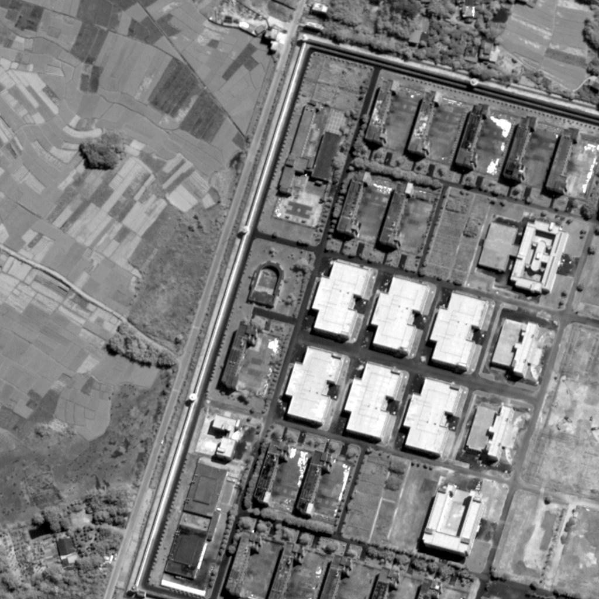
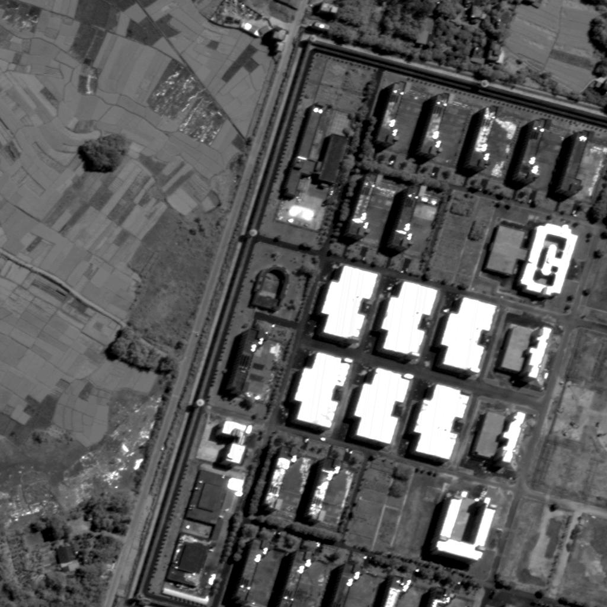
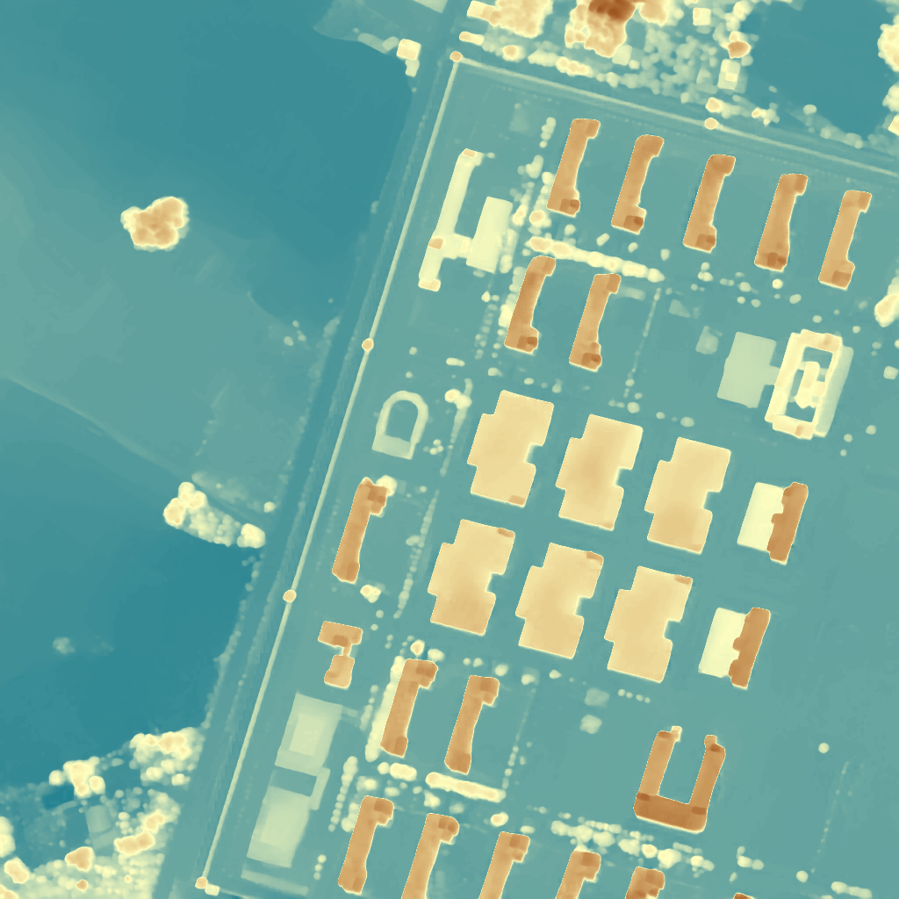
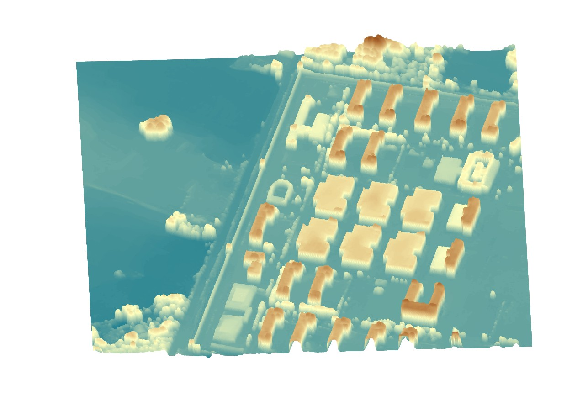
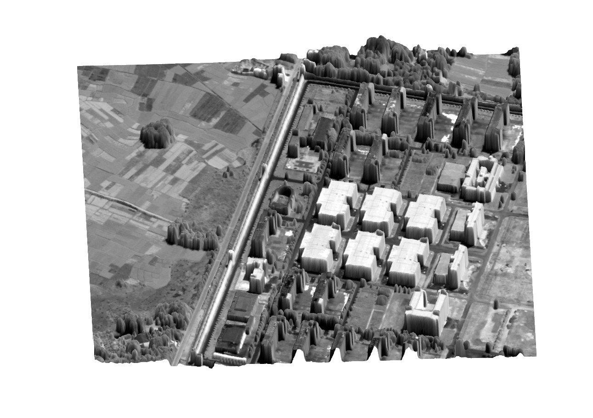
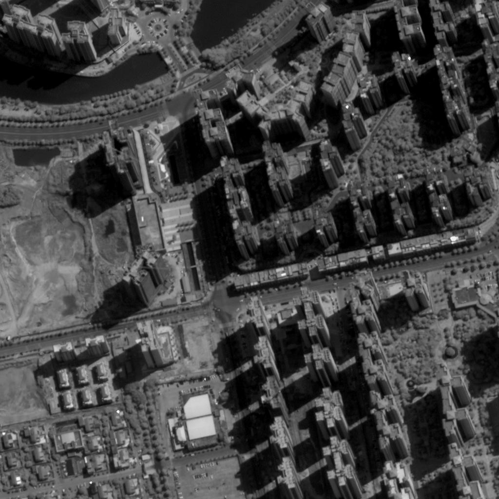
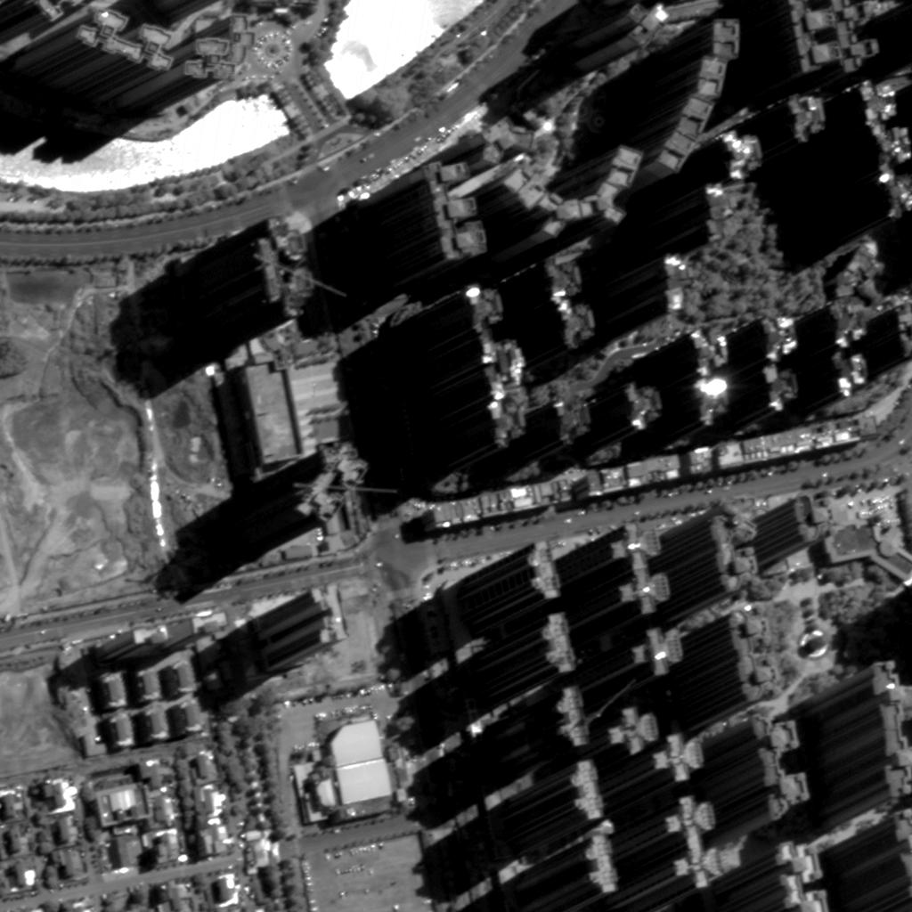
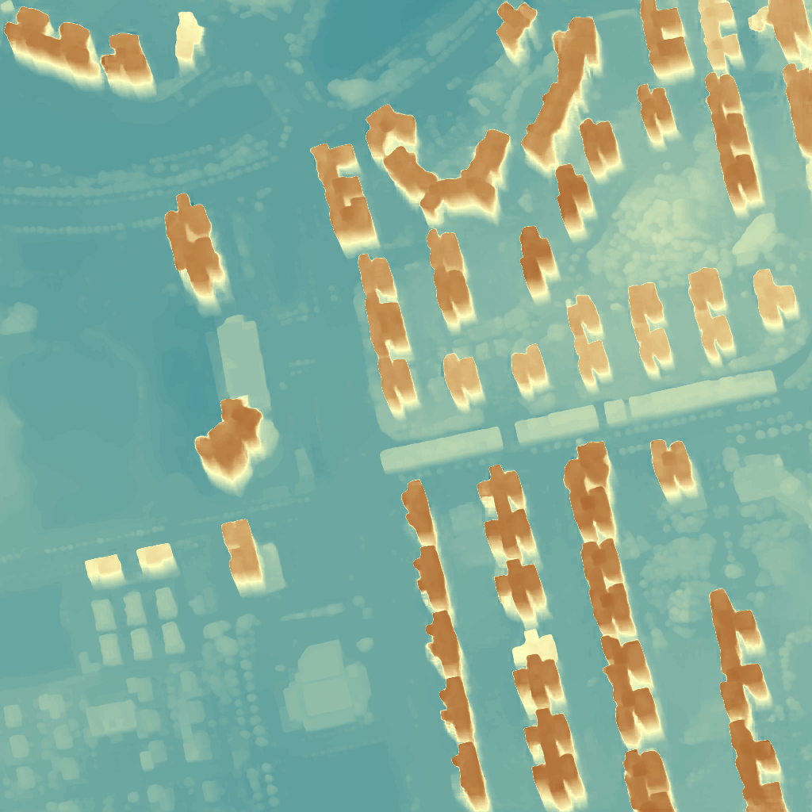
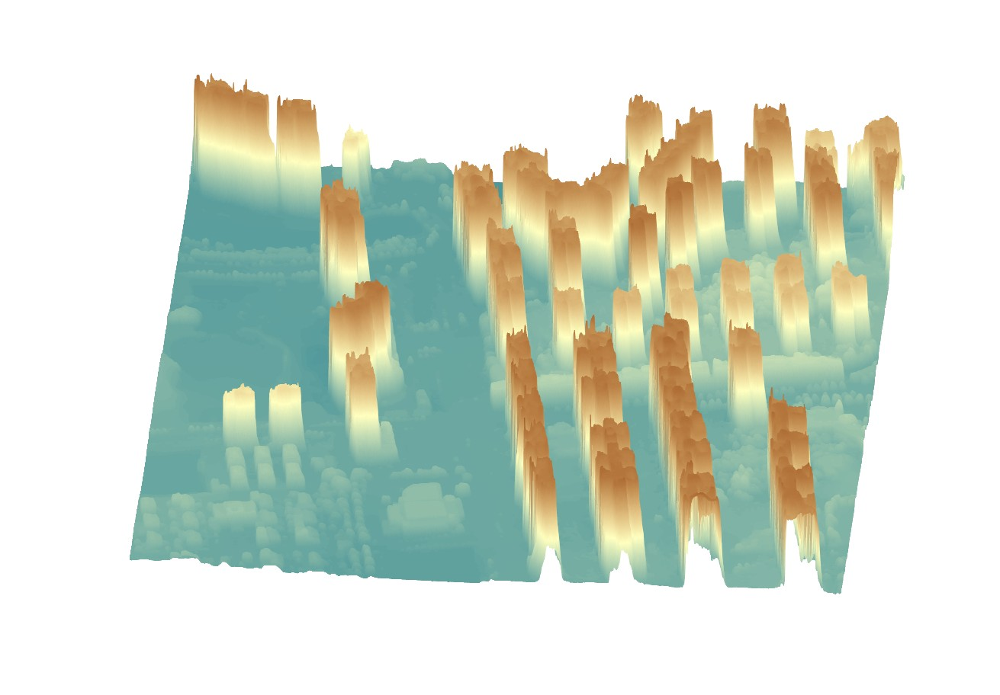
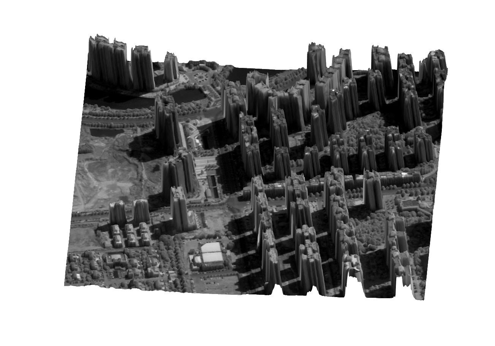

# MyRepository
We design an end to end stereo matching network, which could used for remote sensing stereo matching tasks.
We provided some examples of Gaofen-7 satellite images for demonstration.

## Disparity result and 3D visualization
  

 

  

 

## KITTI Result

